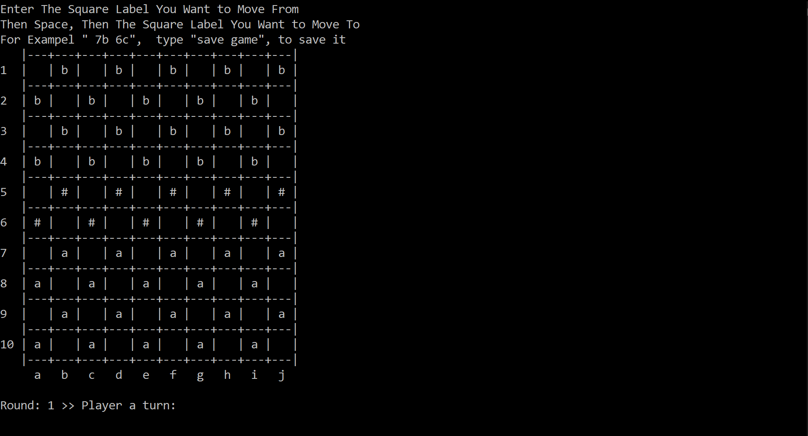

# international-checkers-game-
a program which will let two players play a game of international checkers
The rules of the game can be found at https://en.wikipedia.org/wiki/International_draughts
The game board should be displayed as shown in the picture. in the program. Use the character
'a' to indicate a light piece and the character 'b' to indicate a dark piece. To indicate a
crowned 'a' use the character 'A' and to indicate a crowned 'b' use the character 'B'. The
character '#' indicates an space not occupied by any piece.

